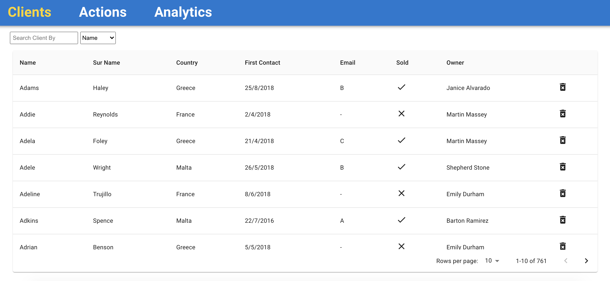
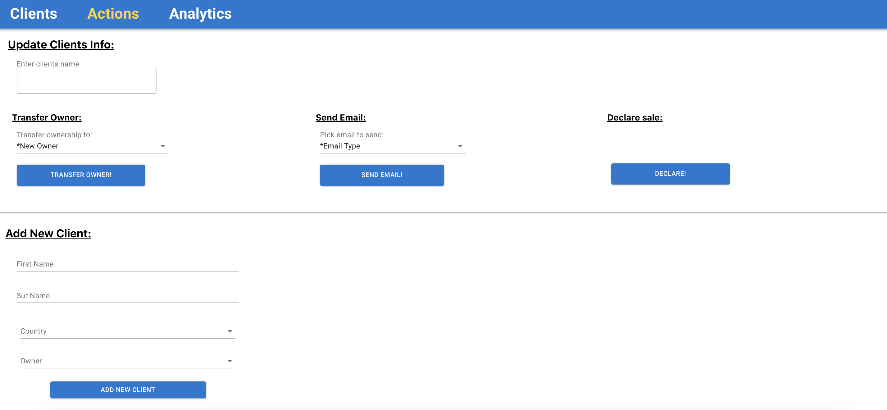
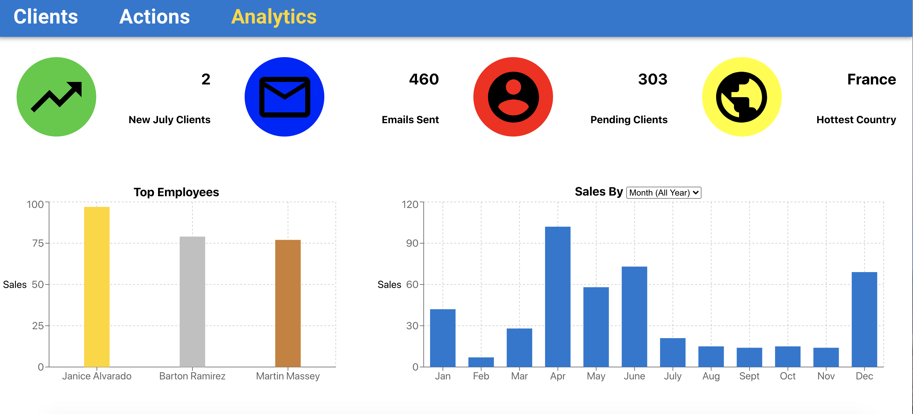

# CRM 

CRM is a Client Ralationship Management system built with React. It includes a graphic analytics dashboard for company reports.

Demo: [https://eitan-crm.herokuapp.com/](https://eitan-crm.herokuapp.com/)

## Table Of Contents
- [CRM](#CRM)
  * [Running the project](#running-the-project)
  * [Screenshots](#screenshots)
    + [Client List](#client-list)
    + [Add or Update Client](#add-or-update-client)
    + [Analytics Dashboard](#analytics-dashboard)
  * [Tech Stack](#tech-stack)

## Running the project
Preferably check the demo link :)

Oherwise:

1. Clone the repo.
2. Run `npm install`.
3. Run `npm run build`
4. Run `npm start`.
5. Navigate to `http://localhost:4000`.

## Screenshots

### Client List
An overview of all your clients. You can filter by name, the different owners, emails, countries & by clients who bought our product. A client can be double clicked to pull up a popup and update the clients basic info.

### Add or Update Client
In order to add a new client fill out the inputs and then click *add*.

In order to update a clients info pick a client by name, enter the new info and excute accordingly.

When adding/updating a snackbar will popup to confirm success / describe the error.

### Analytics Dashboard
View a report of all the metrics regarding your clients.
Notice that the sales graph is dynamic to the dropdown bar value.

## Techstack
1. React, MobX, Recharts, Material-UI and Axios.
2. Express (Node.js), SQL (Sequelize). 